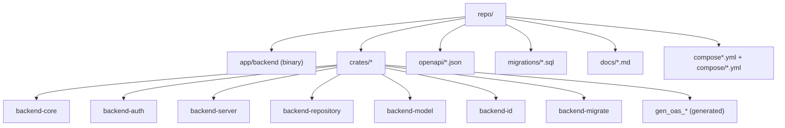
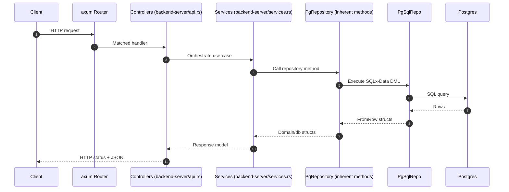
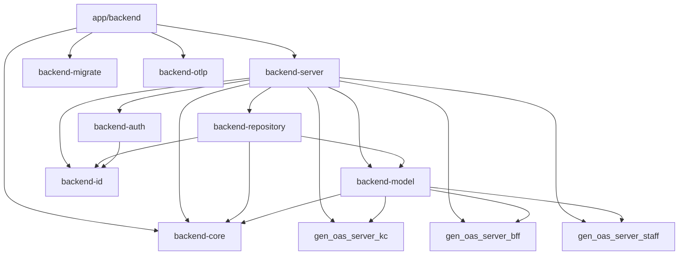
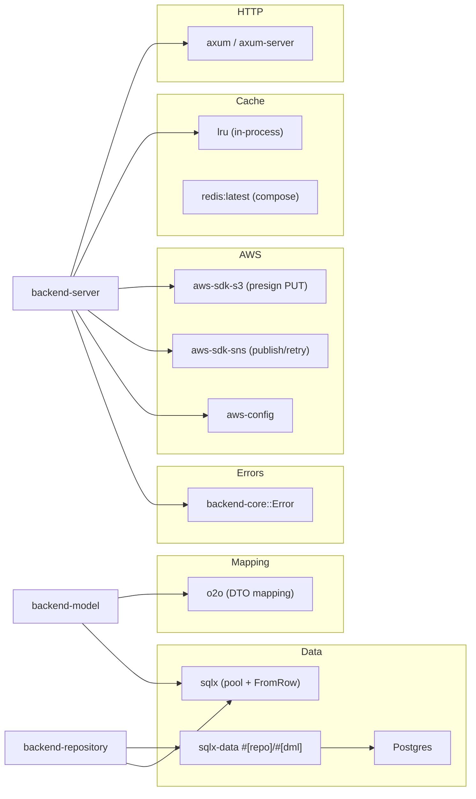
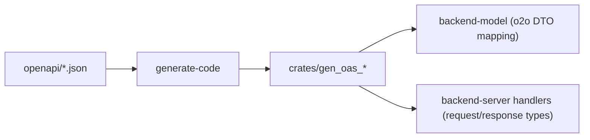

# Architecture

This workspace runs a native `axum` backend for KC, BFF, and Staff APIs.  
Generated OA3 crates are used for DTO/model contracts, not runtime request dispatch.

## Structure

## Runtime Flow (Controller → Service → Repository)

## Crate Relationship Graph

## Libraries and Usage

## OpenAPI to Runtime Path

