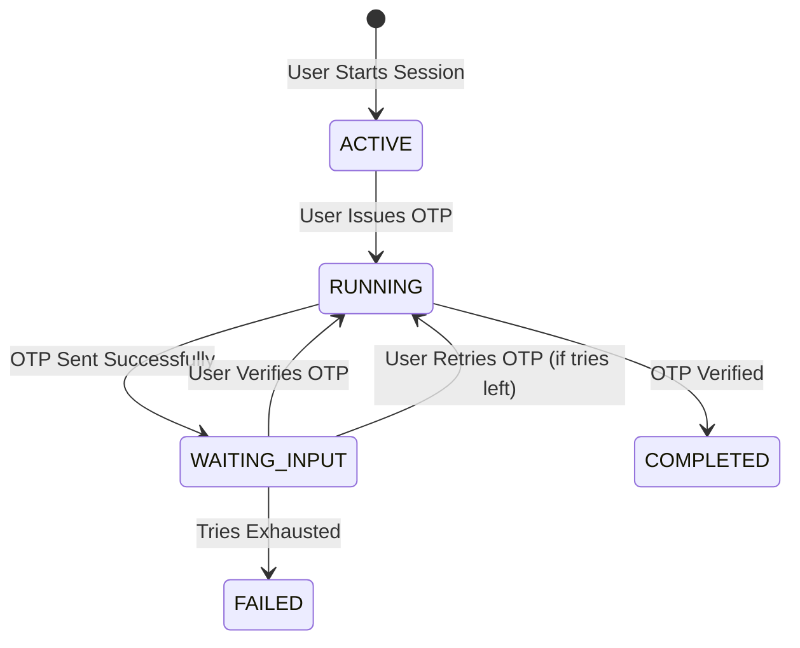
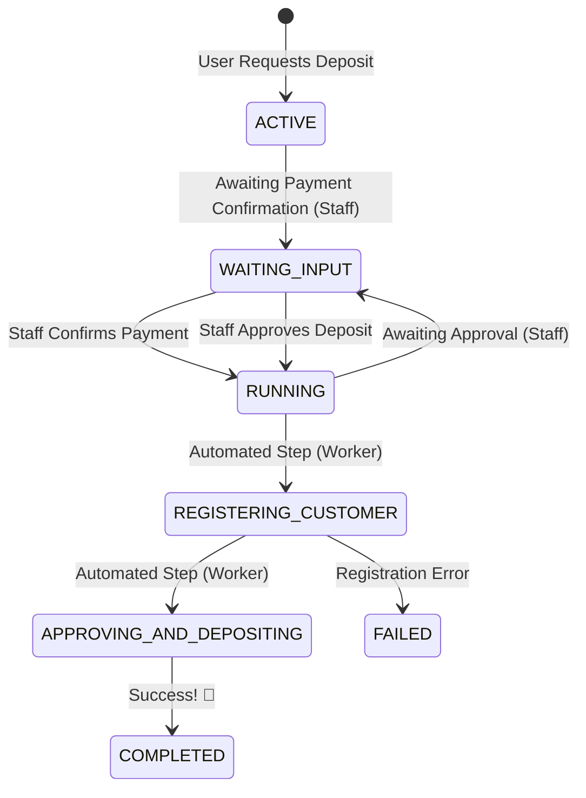

# State Machines & Flows 🔄

## Why?
Complex flows like KYC and Phone OTP verification are prone to errors and race conditions! By using a robust state machine, we can manage these transitions safely and consistently every single time! ✨

## Actual
Our state machines are powered by a generic engine that tracks instances, events, and step attempts in our PostgreSQL database. 🛠️

### BFF KYC Sessions & Steps
The BFF surface exposes a small "session + steps" API used by the client to organize KYC-related UX.

- **Session**: created via `POST /bff/internal/kyc/sessions` and backed by a `sm_instance` (currently `KYC_PHONE_OTP` for user KYC sessions).
- **Step**: created via `POST /bff/internal/kyc/steps`; step IDs are deterministic `"{sessionId}__{type}"` and are stored in the session `context.step_ids`.
- **Supported step types**: `PHONE`, `EMAIL`, `ADDRESS` (per `openapi/user-storage-bff.yaml`).
- **Type-specific enforcement**:
  - OTP issue/verify endpoints expect a `PHONE` step ID.
  - Magic email issue endpoints expect an `EMAIL` step ID.
  - Upload presign/complete endpoints enforce ownership by JWT `userId` (not by step type).

### KYC Phone OTP Flow
This state machine handles phone number verification through SMS OTPs.

### KYC First Deposit Flow
This more complex flow involves staff interaction and external service registration.

## Constraints
- Every step is tracked in `sm_step_attempt`.
- Transitions are triggered by events recorded in `sm_event`.
- Context data (like deposit amounts or OTP hashes) is stored as JSON in the instance.

## Findings
The generic state-machine engine is incredibly powerful! We can easily retry failed automated steps from the Staff API without manually modifying database rows! 🛠️ It's saved us so much time! 🥳

## How to?
To add a new state machine:
1. Define the kind and steps in `app/crates/backend-server/src/state_machine/types.rs`.
2. Implement the engine logic in `app/crates/backend-server/src/state_machine/engine.rs`.
3. Add the API surface calls in BFF or Staff controllers. 🛠️

## Conclusion
State machines are our best friend when it comes to managing complex business logic! They keep our code clean, reliable, and observable! 🥳✨
